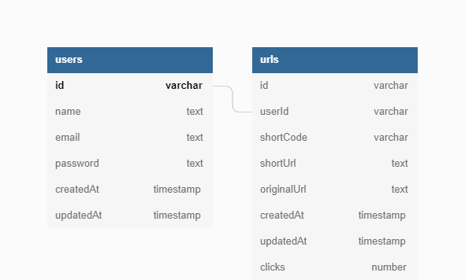

# URL Shortner APP

## Tech stack
- [Nest](https://github.com/nestjs/nest)
- Docker
- PostGreSQL
- TypeORM


## Prerequisite 
- Docker installation

## Dependencies installation
Need to run 
```bash
$ yarn
```

## Running the app
Need to run
```bash
$ docker-compose up
```
_Application will start on port `4040`. Navigate to [App](http://localhst:4040)_ 

## DB Diagram
There will two tables `users` and `urls`.
